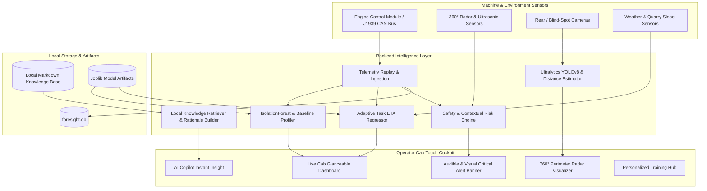

# Architecture Documentation: CAT ForeSight Copilot

## 1. System Overview & Core Principle

**CAT ForeSight Copilot** is an operator-first decision support system designed specifically for the heavy machinery cab environment (hydraulic excavators, wheel loaders, articulated haul trucks).

> **Safety Disclaimer**: The Copilot provides contextual risk intelligence, explainable diagnostics, and recommendations only. All machine actuation, braking, and steering remain strictly in external electro-hydraulic machine control modules and human operator command.

---

## 2. Safety Risk Assessment Flow

The risk evaluation uses a dual-layer strategy:
1. **Deterministic Overrides**:
   - Seatbelt unfastened while ground speed > 0.5 km/h -> `CRITICAL` (Score 95).
   - Pedestrian <= 5.0m while in Reverse -> `CRITICAL` (Score 92).
   - In wet conditions (rain > 2mm/hr), proximity threshold dynamically expands to 7.5m.
   - Hydraulic oil temperature > 98°C -> `CRITICAL` (Score 85).
2. **Contextual Risk Continuous Scoring**:
   $$\text{Risk} = \text{Clamp}_{0}^{100}\left(\text{Risk}_{\text{env}}(\text{rain}, \text{vis}, \text{slope}) + \text{Risk}_{\text{proximity}}(\text{dist}, \text{direction}, \text{objects})\right)$$

---

## 3. Explainable Anomaly Detection Flow

- **Model**: Scikit-Learn `IsolationForest` combined with operator-specific moving baselines.
- **Explainability Rule**: Anomalies in fuel rate or engine load are never flagged as "operator error" automatically.
- Multi-factor attribution checks terrain slope, bucket payload tonnage, and truck staging wait idle time before concluding task/environment influences.

---

## 4. Machine Learning ETA Architecture

- **Baseline Model**: Scikit-Learn `Ridge` Regression (MAE: 1.69 min, $R^2$: 0.966).
- **Final Model**: Scikit-Learn `HistGradientBoostingRegressor` (MAE: 0.67 min, $R^2$: 0.995).
- Generates point estimation, dynamic uncertainty prediction intervals ($\pm 8\% - 15\%$), and confidence scoring (High / Medium / Low).
